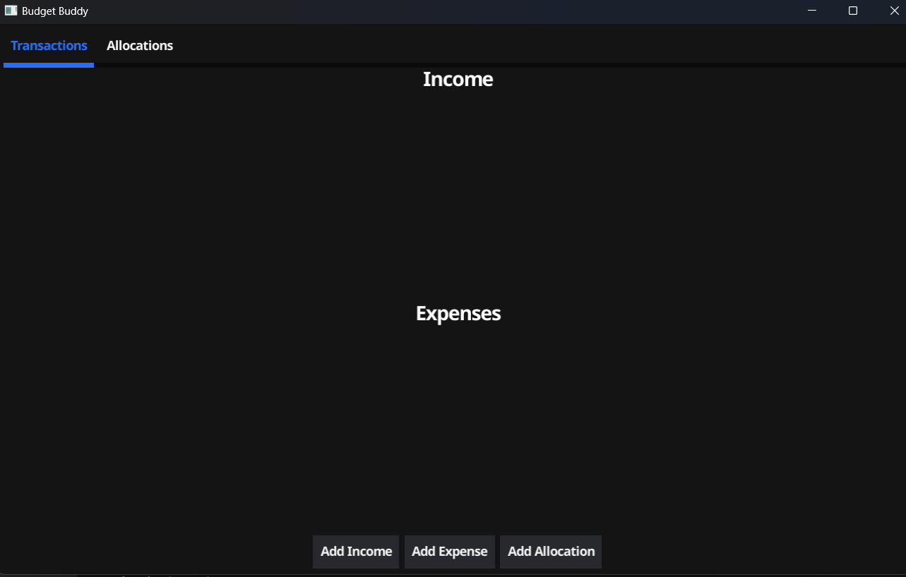
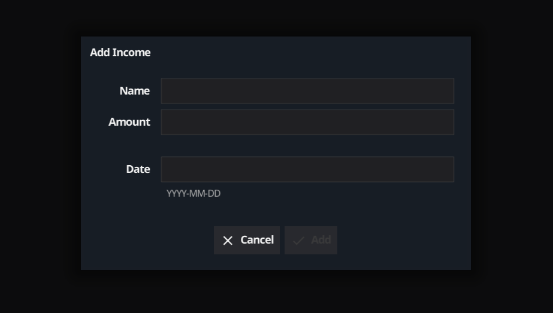
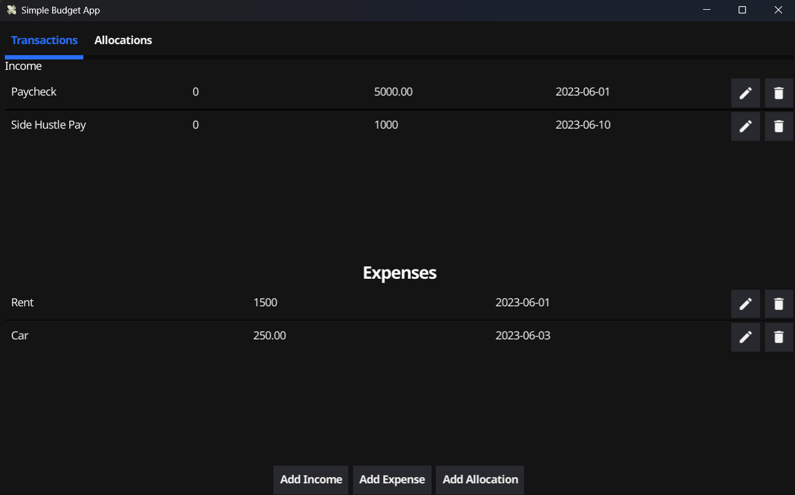
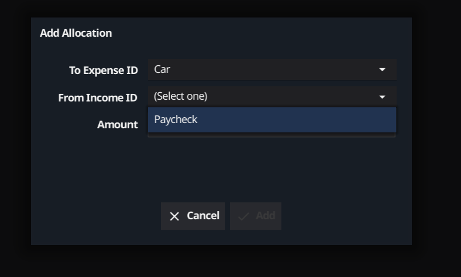
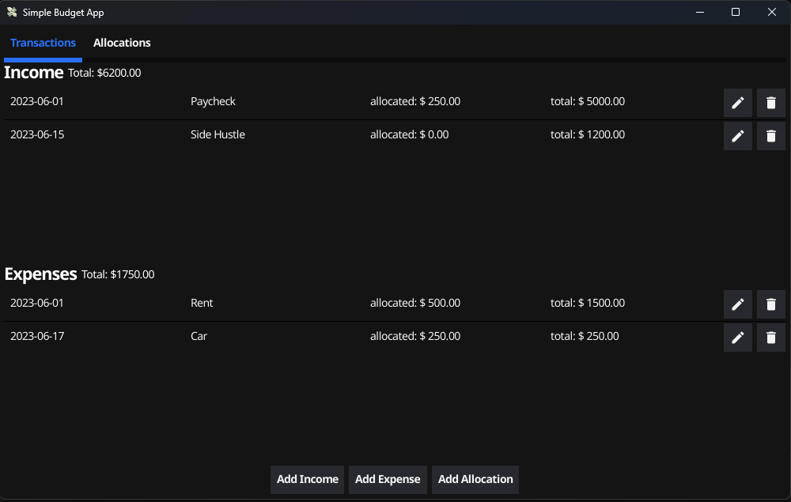
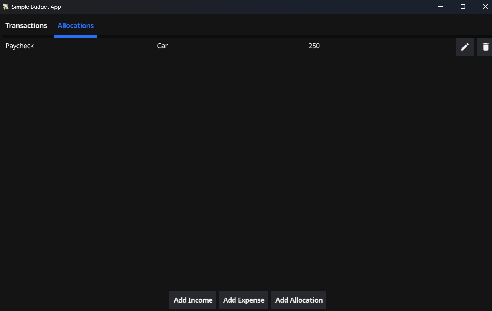

# Simple Budget Application
*Mixed Machine* <br />
*mixedmachine.dev@gmail.com*

## Description
This is a simple budget application that allows the user to add expenses and deposits to their budget then allocate the funds to track where the income is going. This application uses a Mongo database, . The application is downloadable and uses Mongo for the database. As of now, you will need to provide your own Mongo database to use this application. Add the mongo uri in a .env file in the same directory as the main.go file. The .env file should look like this:

```
MONGO_URI=<your mongo uri>
```


## Table of Contents
* [Installation](#installation)
* [Usage](#usage)
* [Future Features](#future-features)
* [Bugs](#bugs)
* [License](#license)


## Installation
To install the application, clone the store and run `make init` or `make build.win/lin` or `make run` to install the dependencies.

If you do not have make installed, you can run `go mod download` to install the dependencies. The application can be run with `go run main.go` or `go build main.go` and then `./main.exe` or `./main` depending on your operating system.

## Usage








## Future Features
- [ ] Expense highlighting based on allocated funds
    - [ ] Red if nothing allocated
    - [ ] Yellow if partially allocated
    - [ ] Green if fully allocated
- [ ] Allocation of each Income
- [ ] Auto-allocation based on available income and date of expenses
- [ ] Button to convert all dates of budget to next month
- [ ] Button to convert all dates of budget to previous month
- [ ] Button to convert all dates of budget to current month
    - [ ] With these feature I do not want to save each month's budget, but rather have the user be able to change the month they are looking at for convenience
    - [ ] Due to the above, there should be an export button to "snapshot" the current budget
- [ ] Add a "snapshot" button to save the current budget
- [ ] Add a "load" button to load a saved budget
- [ ] Add a "clear" button to clear the current budget
- [ ] enable the user to add a notes
- [ ] enable a switch to save locally or to remote database (paid feature)
- [ ] Add login (paid feature)


## Bugs
- [ ] The application uses local storage to save the budget items
- [ ] Allocations of income do no delete when the income is deleted
- [ ] On mobile, backspace double deletes
- [ ] In light mode, the headers are not visible
- [x] Crashes when the user tries to update an expense name
- [ ] Text hint on allocations edit is wrong
- [ ] Allocation doesn't need to do anything to income.Allocation
- [ ] income.Allocation should be removed since switching to sql database for getting income allocaitons

\* Add more bugs in github issues as they're found


## License:
This project is licensed under the MIT License - see the 
[LICENSE.md](./LICENSE.txt) file for details.
